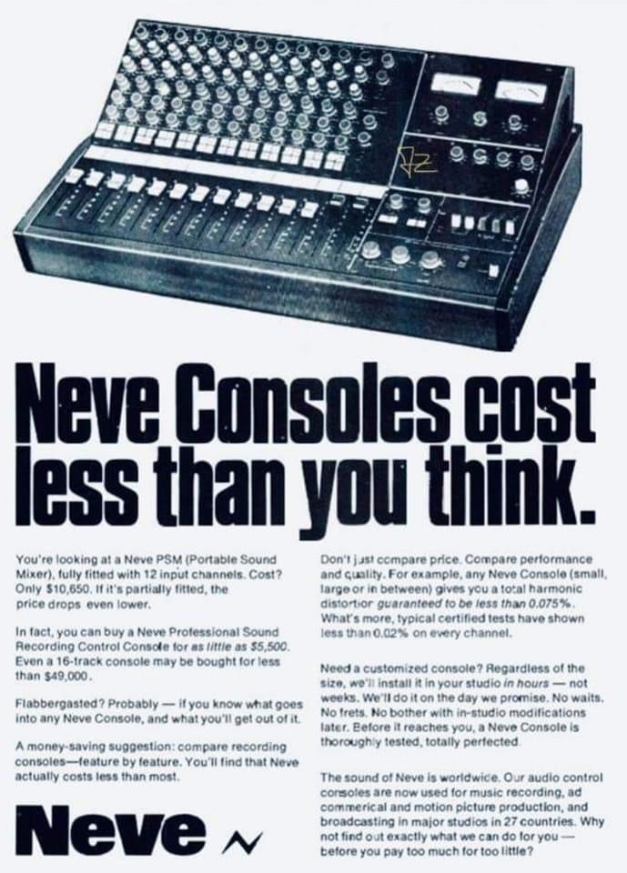
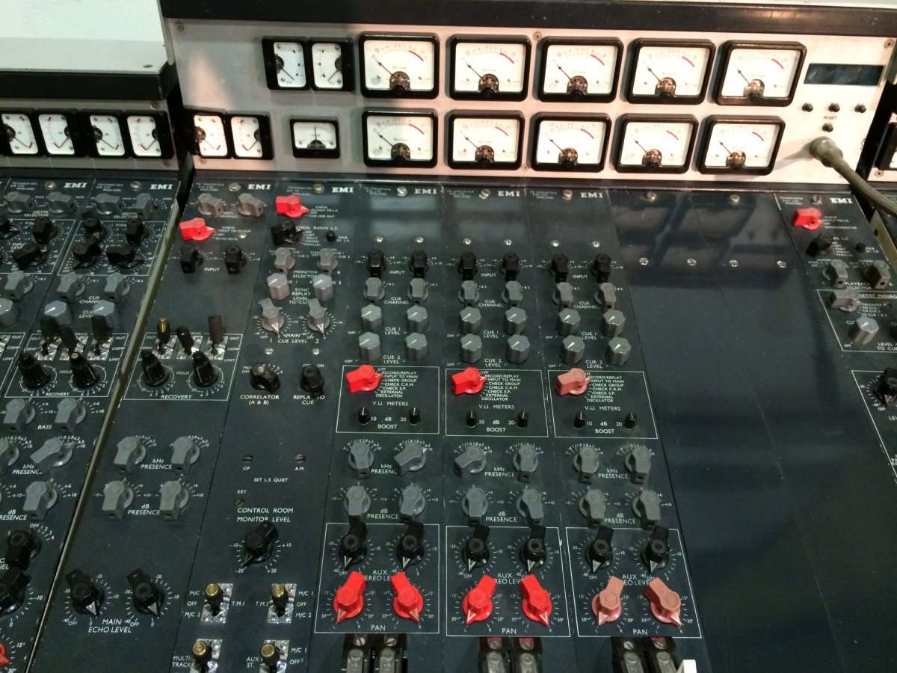
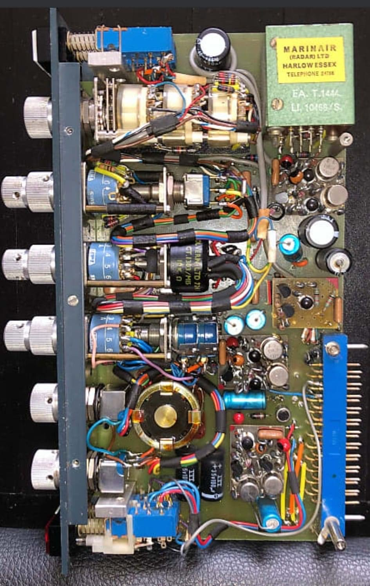

*continued from the introductory text on the [home page](/):*

The reason there's been such a big renaissance of analog gear, love of analog consoles for tracking during big recording sessions as well as mixing is closely related to the fact that they are widely considered to add a certain coloration or <<warmth>> to the sound that's pushed through their ([discrete](https://en.wikipedia.org/wiki/Electronic_component)) circuits, that In-The-Box recording techniques don't. It's the reason behind a big market for analog summing devices, high-end analog-to-digital converters, analog outboard gear as well as hybrid set-up techniques where mix engineers and producers work In-The-Box but -- at the same time -- process specific mix channels, entire [Stems](https://en.wikipedia.org/wiki/Stem_(audio)) or simple sounds through analog equipment -- back into a final digital bounce to disk inside a computer for ease of editing, distribution & storage.

| {:height="460px;"} | {:width="185px;"} | {:height="460px;"} | 

## Revival of the analog console
Many companies dedicate large product lines to reproductions of classic analog [Class A](https://en.wikipedia.org/wiki/Power_amplifier_classes) pre-amplifiers, microphones, equalizers, compressors and rack-mountable mixing console [channel-strips](https://en.wikipedia.org/wiki/Channel_strip).

|-----------------+--------------------+-----------------------------------|
| <<Unobtainium>> | ...can't buy EMI's [Abbey Road in a box at auction](https://thevinylfactory.com/features/recording-console-pink-floyd-abbey-road-auction) | [And Marinair only sells to Neve](https://www.ams-neve.com/about-marinair) |
|-----------------+--------------------+-----------------------------------|
| {:width="300px"} | {:height="420px"} | {:width="265px"} |
|-----------------+--------------------+-----------------------------------|

