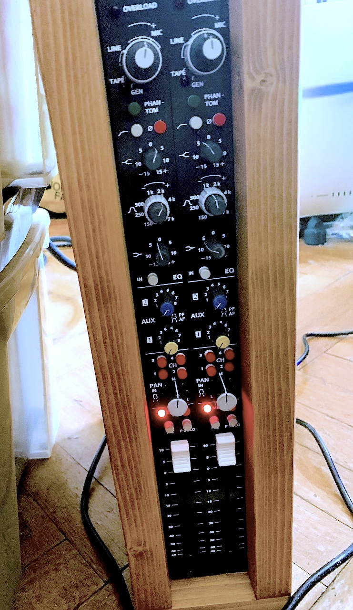
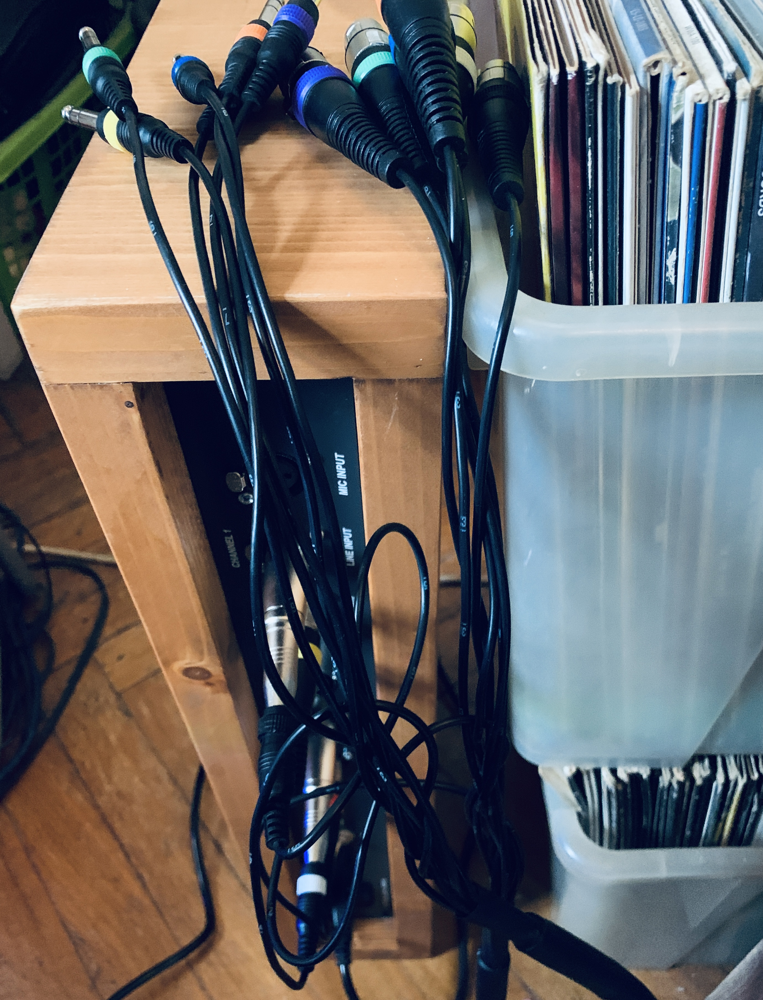
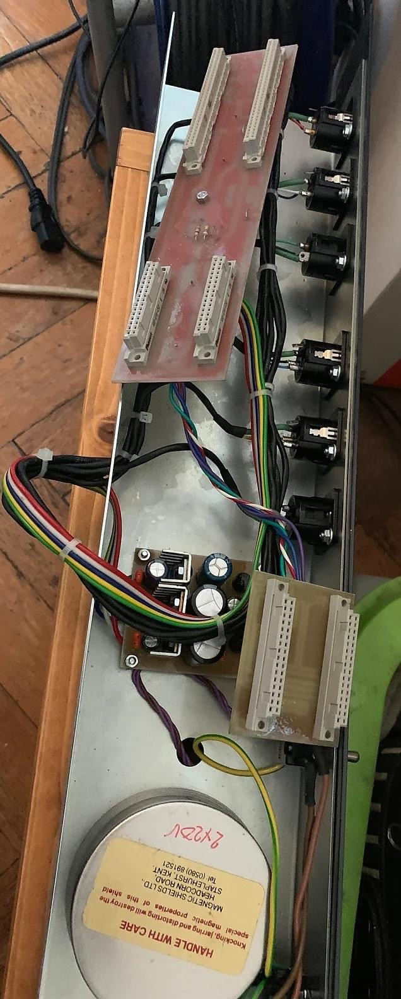
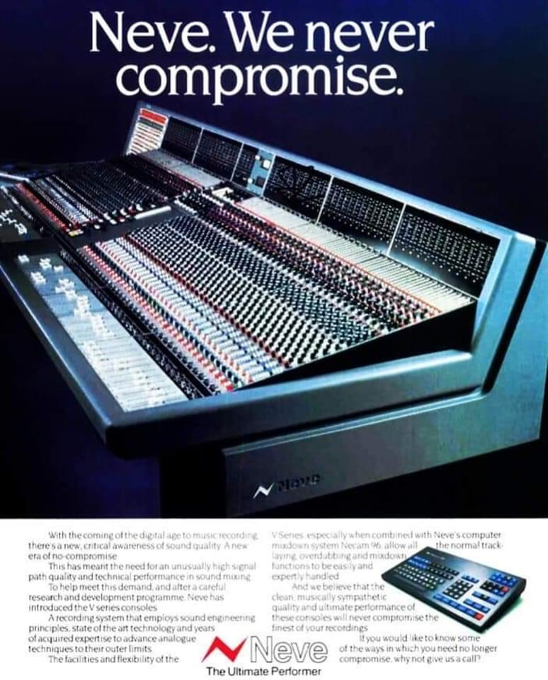

## Second Order Harmonics: the kind of Distortion our ears tend to appreciate

[Harmonics](https://en.wikipedia.org/wiki/Harmonic) are waves of frequencies that are multiples of a so-called <<fundamental>> (i.e. original-- or base) frequency. They are part of music theory and electrical engineering alike; in audio engineering & design there's a common term used to benchmark Distortion in a product, part or audio-chain called [THD](https://en.wikipedia.org/wiki/Total_harmonic_distortion) ([Total Harmonic Distortion](https://en.wikipedia.org/wiki/Total_harmonic_distortion) traditionally written *THD+N*--where *N* stands for *Noise*, as in past times measurement was less accurate and you would include Total Harmonic Distortion and Noise into one metric for ease of measurement.) This practice continues today in audio product specifications, benchmarks and common industry standards --- you'll find these values written out in the details or specs. of products like ADC- & DAC converters, audio interfaces or pre-amplifiers.

> Second-order or ‘even’ harmonics are even-numbered multiples of the fundamental
> frequencies and create a rich, pleasing sound. Third-order or ‘odd’ harmonics are 
> odd-numbered multiples of the fundamental frequencies, which give the signal an 
> edgier, more aggressive sound.

-- from: <https://www.sonarworks.com/blog/learn/when-distortion-is-good>

The reason there's been such a big renaissance of analog gear, love of analog consoles for tracking during big recording sessions as well as mixing is closely related to the fact that they are widely considered to add a certain coloration or <<warmth>> to the sound that's pushed through their ([discrete](https://en.wikipedia.org/wiki/Electronic_component)) circuits, that In-The-Box recording techniques don't. It's the reason behind a big market for analog summing devices, high-end analog-to-digital converters, analog outboard gear as well as hybrid set-up techniques where mix engineers and producers work In-The-Box but -- at the same time -- process specific mix channels, entire [Stems](https://en.wikipedia.org/wiki/Stem_(audio)) or simple sounds through analog equipment -- back into a final digital bounce to disk inside a computer for ease of editing, distribution & storage.

| {:width="475px;"} | {:height="460px;"} | {:width="250px;"} | {:height="460px;"} | 

## Revival of the analog console
Many companies dedicate large product lines to reproductions of classic analog [Class A](https://en.wikipedia.org/wiki/Power_amplifier_classes) pre-amplifiers, microphones, equalizers, compressors and rack-mountable mixing console [channel-strips](https://en.wikipedia.org/wiki/Channel_strip).

|-----------------+--------------------+-----------------------------------|
| <<Unobtainium>> | ...can't buy EMI's [Abbey Road in a box at auction](https://thevinylfactory.com/features/recording-console-pink-floyd-abbey-road-auction) | [..and Marinair only sells to Neve*](https://www.ams-neve.com/about-marinair) |
|-----------------+--------------------+-----------------------------------|
| {:width="300px"} | {:height="420px"} | {:height="420px"} |
|-----------------+--------------------+-----------------------------------|

###### * at least that's what AMS-Neve wants you to think, in reality the old and newly incorporated Neve companies went through multiple transformer designs and suppliers --- transformer winding details had been leaked on-line in the years since --- and it's now common knowledge that Marinair stopped producing transformers early on, St Ives and other companies took over production- and was eventually bought by the Carnhill company -- which transformers are found in many Neve clones and other audio products. A short history on Neve transformers can be found *[here by BAE Audio](https://www.youtube.com/watch?v=gTPkDHDp8QQ)*

**more to come in this section.**

## What we do and can offer
We build customer made-to-order Clones of vintage Neve, API, EMI/TG Preamplifiers, Equaliziers, compressors in API 500 Series Module format, as Outboard gear and so much more.

We modify 500 series units with Colour Modules, custom OpAmps (vintage, new or modern replicas), refurbish vintage console parts and channel-strips --- that used to be in consoles, modify them and design our own units and parts as needed.

If you have an idea in mind you'd like to get realized just let us know!

### Examples

For example: we've recieved requests for custom pre amps with saturation colours or with automation. We've looked into integrating [gcon automation](https://wesaudio.com/gcon-open-system/) into existing 500 modules for customers that own and already use this system in their production work flows. 

Another example may be an audio routing/patching unit that's remotely controlled for easy recall and chaining of 500 series modules and outboard gear in the context of a tracking or mixing session.

## Contact

Just get in contact with us via the contact form below or send an email to [info@secondorderharmonics.eu](mailto:info@secondorderharmonics.eu) with your request.

#### V-Card

Don't forget to check out our [Reverb shop](https://reverb.com/shop/analog-audio-boutique) for finished products or optional mods.

