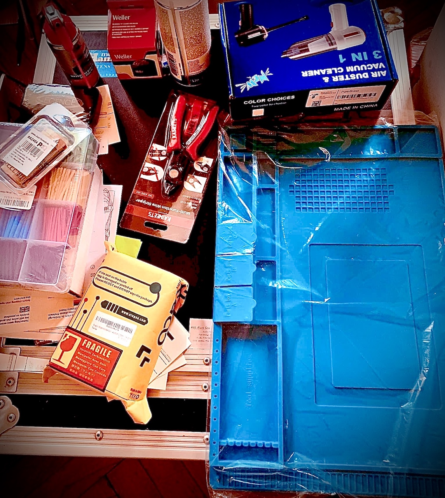

## Second Order Harmonics: the kind of Distortion our ears tend to apprechiate

[Harmonics](https://en.wikipedia.org/wiki/Harmonic) are waves of frequencies that are multiples of a so-called <<fundamental>> (i.e. original-- or base) frequency. They are part of music theory and electrical engineering alike; in audio engineering & design there's a common term used to benchmark Distortion in a product, part or audio-chain called [THD](https://en.wikipedia.org/wiki/Total_harmonic_distortion) ([Total Harmonic Distortion](https://en.wikipedia.org/wiki/Total_harmonic_distortion) traditionally written *THD+N*--where *N* stands for *Noise*, as in past times measurement was less accurate and you would include Total Harmonic Distortion and Noise into one metric for ease of measurement.) This practice continues today in audio product specifications, benchmarks and common industry standards --- you'll find these values written out in the details or specs. of products like ADC- & DAC converters, audio interfaces or pre-amplifiers.

> Second-order or ‘even’ harmonics are even-numbered multiples of the fundamental
> frequencies and create a rich, pleasing sound. Third-order or ‘odd’ harmonics are 
> odd-numbered multiples of the fundamental frequencies, which give the signal an 
> edgier, more aggressive sound.

-- from: <https://www.sonarworks.com/blog/learn/when-distortion-is-good>

The reason there's been such a big renaissance of analog gear, love of analog consoles for tracking during big recording sessions as well as mixing is closely related to the fact that they are widely considered to add a certain coloration or <<warmth>> to the sound that's pushed through their ([discrete](https://en.wikipedia.org/wiki/Electronic_component)) circuits, that In-The-Box recording techniques don't. It's the reason behind a big market for analog summing devices, high-end analog-to-digital converters, analog outboard gear as well as hybrid set-up techniques where mix engineers and producers work In-The-Box but -- at the same time -- process specific mix channels, entire [Stems](https://en.wikipedia.org/wiki/Stem_(audio)) or simple sounds through analog equipment -- back into a final digital bounce to disk inside a computer for ease of editing, distribution & storage.

| {:width="475px;"} | {:height="460px;"} | {:width="250px;"} | {:height="460px;"} | 

## Revival of the analog console
Many companies dedicate large product lines to reproductions of classic analog [Class A](https://en.wikipedia.org/wiki/Power_amplifier_classes) pre-amplifiers, microphones, equalizers, compressors and rack-mountable mixing console [channel-strips](https://en.wikipedia.org/wiki/Channel_strip).

|-----------------+--------------------+-----------------------------------|
| <<Unobtainium>> | ...can't buy EMI's [Abbey Road in a box at auction](https://thevinylfactory.com/features/recording-console-pink-floyd-abbey-road-auction) | [..and Marinair only sells to Neve*](https://www.ams-neve.com/about-marinair) |
|-----------------+--------------------+-----------------------------------|
| {:width="300px"} | {:height="420px"} | {:height="420px"} |
|-----------------+--------------------+-----------------------------------|

###### * at least that's what AMS-Neve wants you to think, in reality the old and newly incorporated Neve companies went through multiple transformer designs and suppliers --- transformer winding details had been leaked on-line in the years since --- and it's now common knowledge that Marinair stopped producing transformers early on, St Ives and other companies took over production- and was eventually bought by the Carnhill company -- which transformers are found in many Neve clones and other audio products. A short history on Neve transformers can be found *[here by BAE Audio](https://www.youtube.com/watch?v=gTPkDHDp8QQ)*

XXX/TODO: final content section and links to other subpages

