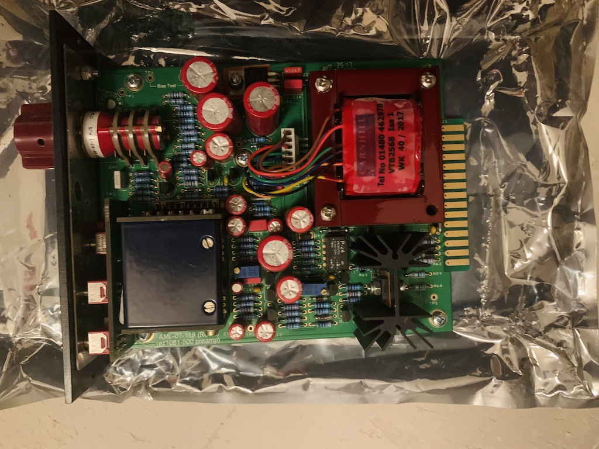
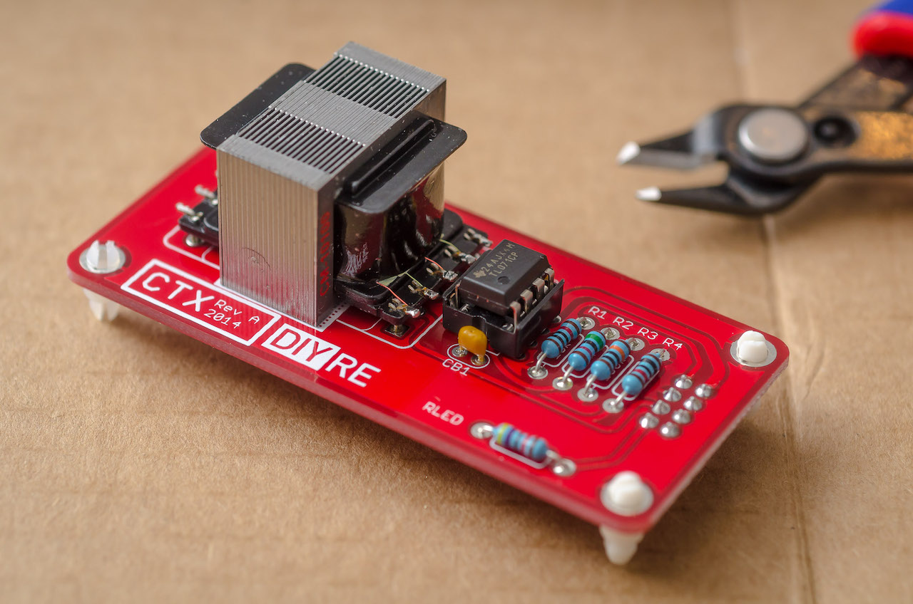
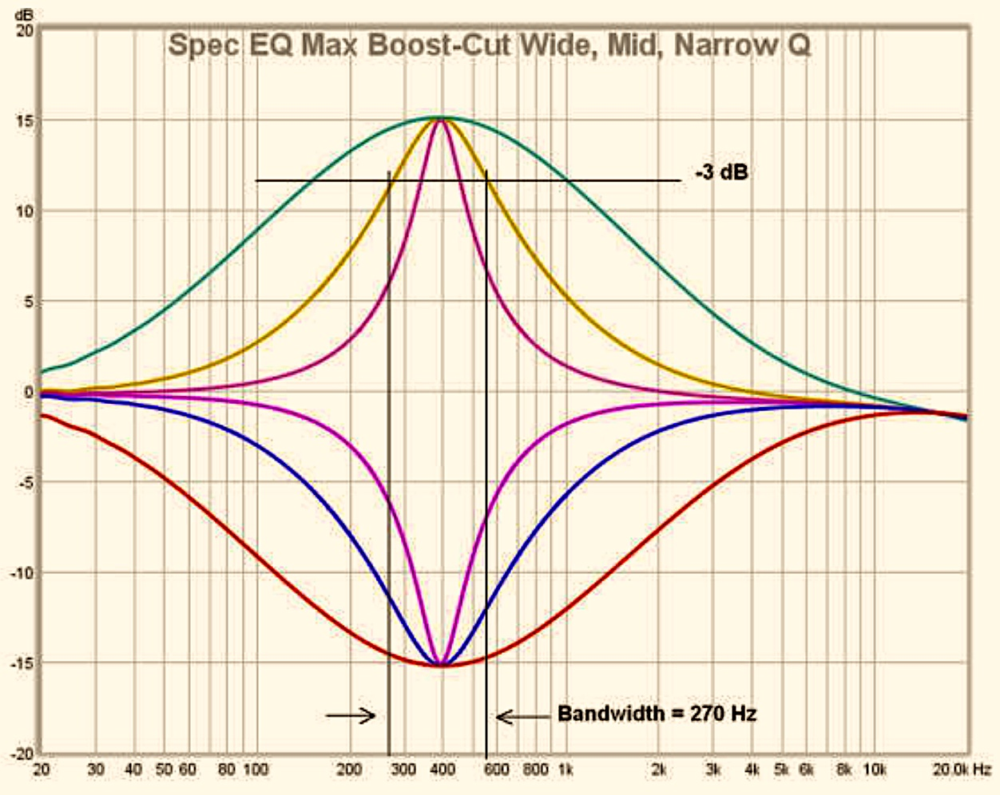

## Modifications and Custom work

Tailor made for your needs; we adapt and design the highest quality components on the market for this use. From buying original gear and refurbishing it to building the best sounding clones on the market, using only top-notch parts (different options of high quality transformers by Carnhill, Lundahl, Marinair, Cinemag. Obtaining matched pair components we carefully source and test from trusted sources. And check for consistency, build quaility, correct frequency response, harmonic distortion using high-end measuring equipment and the latest techniques in the industry.

| {:height="340px"} | {:height="340px"} | {:height="340px"} | {:height="340px"} |

| {:width="340px"} | {:width="340px"} | {:width="340px"} |

## Fine Tuning and Measurement

We pride ourselves on quality control of all our components, excellent sourcing and measurement of all modifications done to customer equipment. We also provide measurment of frequency response, harmonic distorion, crosstalk et cetera during refurbishment or on assignment of analog consoles, API 500 units, Guitar Pedals and the odd Syntheziser. 

| {:height="280px"} | {:height="280px"} | {:height="280px"} |
