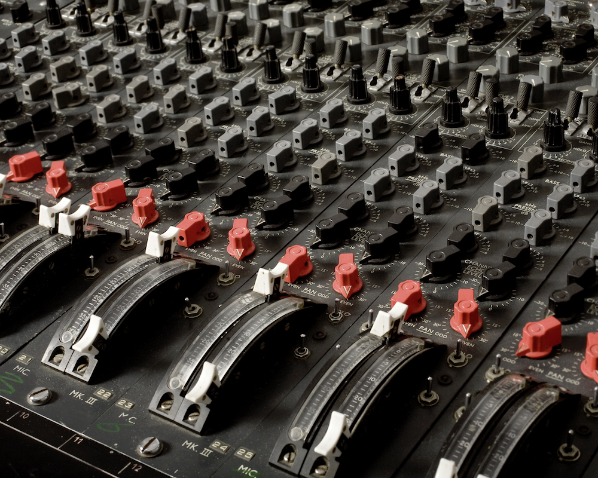
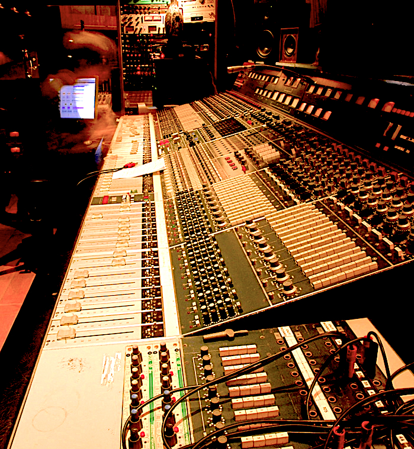
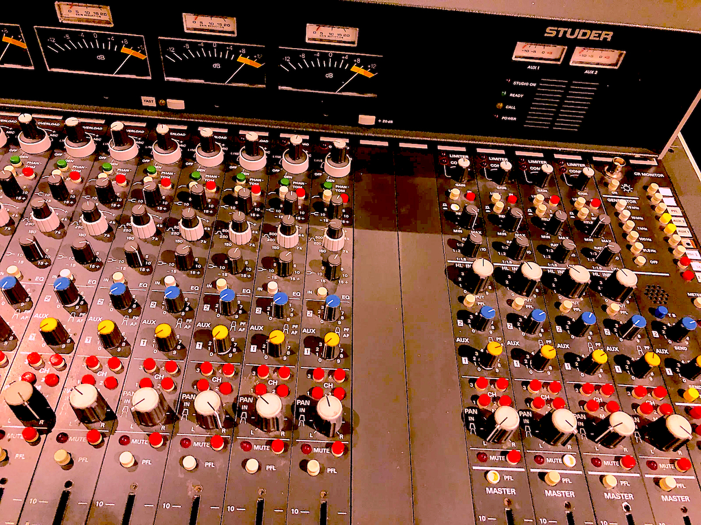
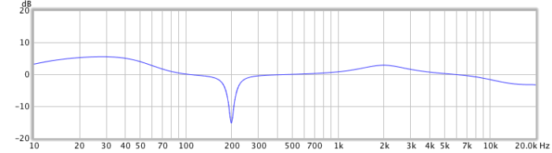
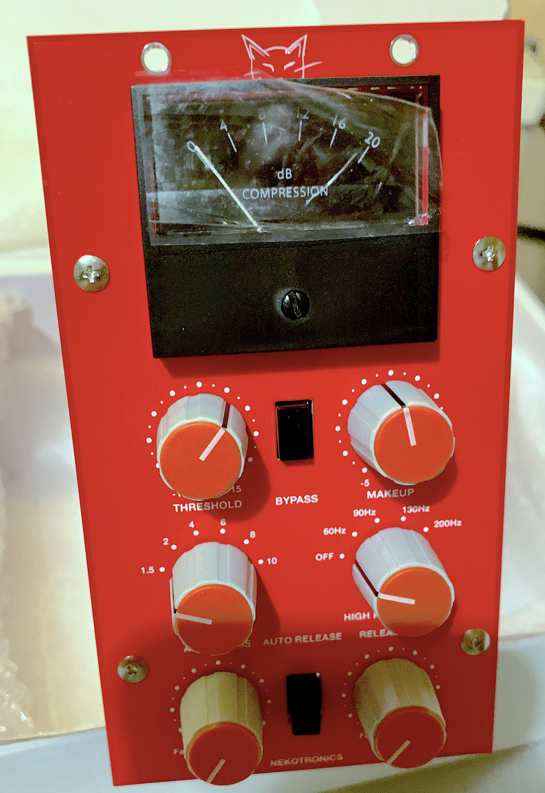
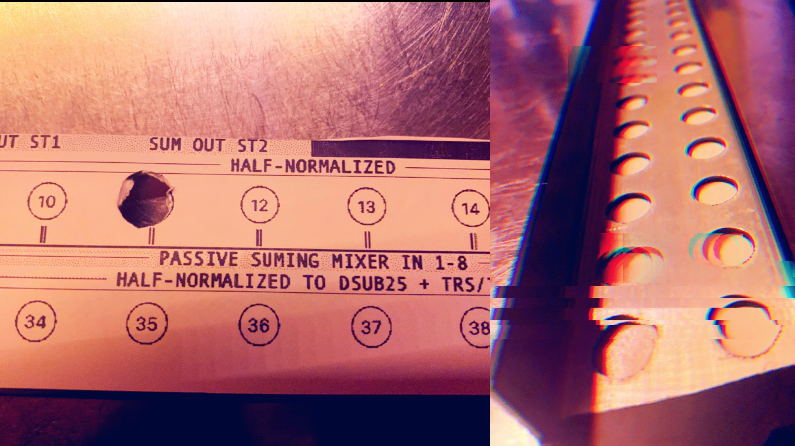

## Rental of Analog Gear and tailor made solutions

| {:width="500px"} | {:width="500px"} | {:width="500px"} |

We rent out classic outboard gear and primarily pre-amplifiers, EQs and compressors of the now-unobtainable legendary recording consoles of the late 50ies to the mid-80ies. Highly mobile, always racked in robust and shock-proof flight cases, our gear is ready to go whereever it is in demand.

 *We base our own- and tailor made &mdash; fit-for-purpose products, special customer requests and DIY/reverse engineering projects, along with all the analog gear we passionately use and modify on some of the finest names in recording industry history:*

- Neve
- EMI/Chandler
- API
- Studer
- Amek
- Focusrite ISA
- BURL 
- ..and many more

| {:width="335px"}	| {:height="330px"} | {:height="325px"} |

From tracking to mastering, we can provide the best choice of gear you wish to use in a particular scenario. And if we rreally don't carry what you're looking for we have great connections to top-notch audio engineers & studio owners, distributors and manufacturers directly.

## Expertise for your Recording Session or Studio project

### Hire us for on-site high-end Audio Engineering, repairs & modifications:

{:height="240px"}

We support recording and tracking sessions by setting up, recalibrating, maintaining and repairing gear as needed on the spot when needed. We also offer the option of modifications to pre-amps, EQs and other parts as needed by using the highest quality reproductions of the classic parts available on the market today. Some lead time applies in most cases, other modifications can be done "hot-swap" and we do carry special parts like pre-amplifiers and EQs which support that option should the need arise during a recording session. 

You tell us your requirements and corner cases, we provide the equipment and support.

| {:width="335px"} | {:height="400px"} | {:height="350px"} |

Please get in contact below for details on rental pricing, audio engineering session support et cetera.

