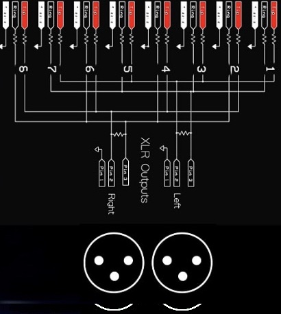

# Analog Summing

| {:width="900px;"} | {:width="600px;"} | {:width="575px;"} |

*via [TapeOp](https://tapeop.com/tutorials/49/analog-summing/)'s J.J. Wiesler*

Recently, we've seen an influx of analog summing mixers on the pro audio scene. Products like the Dangerous Music 2-BUS, Chandler Limited Mini Rack Mixer, Audient Sumo, and Folcrom RMS216 are examples of this emerging market. These mixers are designed to complement your favorite digital audio workstation (DAW), allowing you to reap the benefits of working in both the digital and analog worlds. The algorithms and equations that govern the process of digital summing are tricky and require dithering, rounding off and other possible compromises. Analog summing requires none of these adjustments. It is also a great opportunity to add some common character, or sonic glue, to your tracks. Whether this degradation is real or just perceived doesn't really matter. The truth is, when you sum your tracks through a high quality mixer or analog summing box like the ones mentioned above, your mixes will sound noticeably different. Like many choices in audio, it can't be stated concretely that analog summing improves the sound. It is simply another tool that can help you build the mixes you hear in your mind.

I developed a simple setup technique using my DAW, Pro Tools HD, and analog summing while working on the last record I produced (Aidan Hawken, Pillows and Records). Some years ago, before these other products were introduced, I bought two 10x2 Neve mixers manufactured by Brent Averill (brentaverill.com). They only have volume and pan on each channel, and are linkable. This simplicity as well as the quality of the signal path makes them perfect for use with a DAW as an analog summer. When mix time came around, I had all these sessions whose track counts were anywhere between 16 and 60. With only 20 analog mix channels (most summers come with 16), I needed to do some initial summing within the machine and then output those sums into the mixer. Many engineers utilize a multi- stage summing process when mixing on an analog mixing desk or within a computer. This article describes a setup that is based on these concepts.

The method I developed keeps things as simple and repeatable as possible. The setup features two important benefits: First of all, it allows you to switch back and forth between your 'in the box' mix and your analog mix to easily highlight the difference in sound while also making sure nothing funny is happening. Once you leave the purely digital world, you have to watch out for bad patch cables, out-of-phase wiring and other interferences. Secondly, it creates an analog mix that is 100 percent recallable without the need for a half-million dollar SSL or Neve console. The key is that you can use your DAW for automation, levels, panning and plug-ins and then do the final summing in the analog domain. In order to use this method you will need an interface with multiple outputs, a mixer, and a monitoring matrix such as the Dangerous Monitor, PreSonus Central Station, Grace m904 or the Mackie Big Knob. My setup has 16 outputs via a Digidesign 192, the Neve 20-channel mixer mentioned above, and a Coleman M3 for monitoring. First, patch DAW outputs 1 and 2 into the monitoring matrix input A. This is probably your normal 'in the box' mixing connection anyway. Then, patch DAW outputs 3-16 into your mixer's first 14 inputs. Pan all channels into stereo pairs except for the last two (13 and 14). We will use these for mono lead vocals and mono bass. Leave all track volumes at unity. Patch the mix output of your analog summer into input B of your monitoring matrix.

Within the session, go to I/O setup and click on the bus tab. Pick and rename seven stereo busses — I start at 20 which leaves me the first 20 busses for FX, headphones and whatever else I may need. Renaming the busses makes it easier to keep track of where you'll be sending each track when the time comes to assign each one for output. Depending on what your session looks like, you could name your busses as follows:

Once you've renamed your busses, create six stereo aux tracks and two mono aux tracks. Name these to match your busses and set their input to look at the corresponding bus of the same name. (See Figure 1.)

Next, set the bus outputs to send to your interface outputs starting at output 3. We want to leave 1 and 2 for our digital mix. So Drums are output 3 and 4, Keys are output 5 and 6, etc. Lead Vox and Bass should end up on outputs 15 and 16, respectively.

Next, you'll be creating a series of master faders so that you can control the level being sent to your interface output. In addition to creating a master fader for outputs 1 and 2, which will be the master output of your digital mix, you're going to create a master fader for each of the individual buss outputs. Name these master faders in the same way you named the busses (and aux tracks) but add an "M" on the front of each name to easily distinguish them from your buss track names. For example, Mdrums for drums, Mbass for bass, etc.

The next big step is to reroute all your individual audio and FX tracks to the appropriate bus for summing. Go through your session and assign the master output of each track to its corresponding bus. For example, all your drums will be outputting to the "drums" bus, and all your guitars will be outputting to the "guitars" buss, instead of outputting to the master 1 and 2 stereo outputs.

Once you have reassigned the outputs of each of your individual tracks, no audio tracks or effects tracks should be going directly to an interface output. They should all be routed to a bus within your session. These busses, in turn, are coming up on collective aux tracks. The aux tracks themselves are then sending their audio to an interface output, and the master faders for each aux channel are governing the overall level sent by each aux track to the output.

The last step is to mult the outputs of your aux tracks so their audio is sent to both their unique interface outputs and interface outputs 1 and 2. In Pro Tools, this is done by holding down the ctrl key while selecting an output. You'll see a '+' appear next to the output, signifying that it is routed to multiple outputs. So Drums will be going to outputs 3 and 4 and 1 and 2, keys will be going to outputs 5 and 6 and 1 and 2, and so on. Lead vocals will be going to mono output 15 and stereo output 1 and 2. Bass will be going to mono output 16 and stereo output 1 and 2.

Multing the outputs of each aux master fader will allow you to easily A/B the two different mixes that you have set up. One mix, let's call it Mix A, will be the mix going to output 1 and 2 and will correspond solely with your digital only mix. The other mix, Mix B, will allow you to hear your mix when the summing is happening in the analog realm. When you select monitor matrix A, you hear your DAW mix A and when you select monitor matrix B you will hear your analog mix. With a little calibration to ensure equal levels, the click of a button now allows you to A/B your two mixes, hearing the difference in sound and making sure nothing is getting lost somewhere. This ability to hear the difference between digital and analog summing is really the greatest benefit of the above technique because it allows you to make an informed decision about what your preference may be.

Once you've made your decision and are happy with the sound of the mix, patch the mixer outputs to your favorite 2-track tape deck, Masterlink or right back into your DAW. Happy analog mixing!

